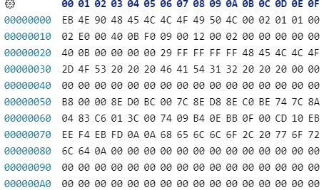
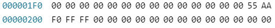
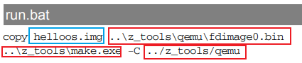
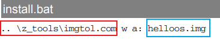
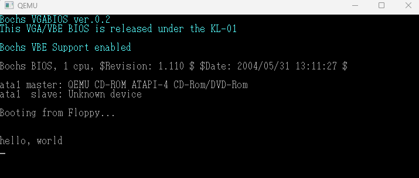

## 实验1, 在作者提供的QEMU上跑helloos

### 第一步
【准备helloos.img  】

内容的编辑可以用二进制编辑器来进行:  

---
...

### 第二步
【下载作者工具包，包含了模拟器软件QEMU】  

http://hrb.osask.jp/tolset_h.zip

### 第三步
【编写执行脚本run.bat和install.bat】
  

  

说明：红色部分表示tolset里面的东西(路径)；蓝色部分表示你创建的helloos镜像文件的名称（因为自己命名时可能会改）

### 第四步
【执行】  
将helloos.img、run.bat、install.bat和tolset/z_new_w文件夹下!cons_9x.bat和!cons_nt.bat这两个文件，总共五个文件放到同一文件夹下  

- (方法一)双击!cons_9x.bat或!cons_nt.bat打开命令行，输入run
- (方法二)打开Windows命令行，移动到这五个文件共同的文件夹下，输入run
- (方法三)双击run.bat执行

### Result
