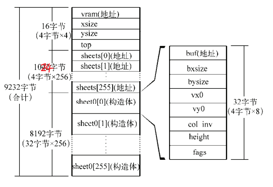

## create order
1. harib007_rearranged

## do what
- harib007_rearranged——Organize source files——add memory.c
- harib007_overlap——add sheet.c（29304KB->29228KB）
- harib007_overlap+——if判断只要更改的部分，加速
- harib007_overlap++——进一步加速
> bx在for语句中并不是在0到bxsize之间循环，而是在bx0到bx1之间循环（对  
> 于by也一样）。而bx0和bx1都是从刷新范围“倒推”求得的。

## emm
> 对于加速的修改的两个过程，直观上没有什么太大的感觉，也许现在的处理器比当年的好太多了？
